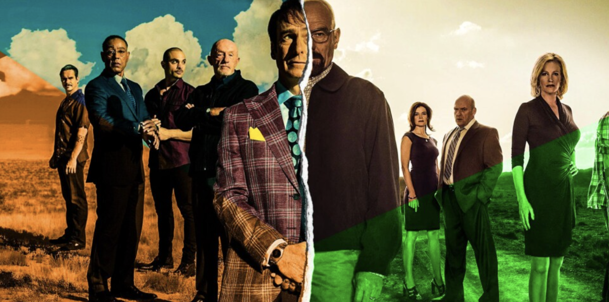
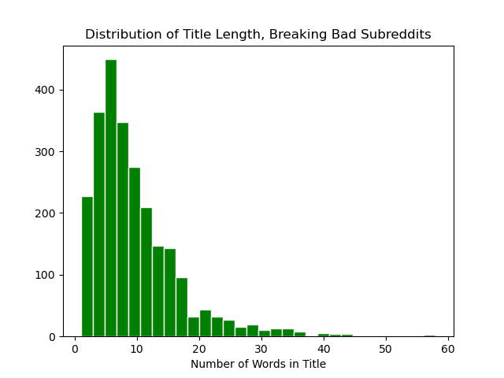
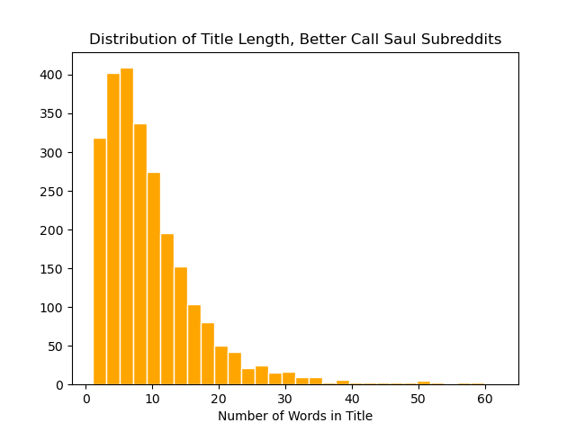
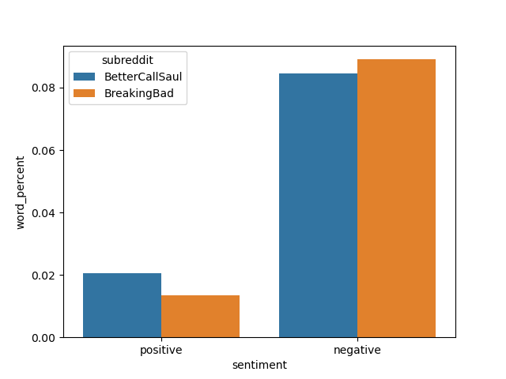
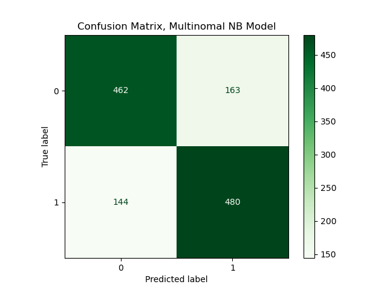
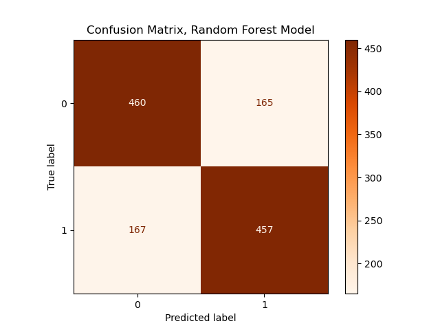

## Breaking Bad or Better Call Saul, That Is The Question?!

## Problem Statement

Breaking Bad is a critically acclaimed American television series that aired from 2008 to 2013. It follows the story of Walter White, a high school chemistry teacher who turns to cooking and selling methamphetamine to support his family after being diagnosed with cancer. The show is known for its complex characters, intense plot, and themes of morality and the consequences of actions ([source](https://en.wikipedia.org/wiki/Breaking_Bad)).  

Better Call Saul is a prequel to Breaking Bad that aired from 2015 to 2022. It follows the story of Jimmy McGill, a small-time lawyer who eventually becomes the notorious criminal lawyer Saul Goodman. The show explores the world of law and order, and the many characters that inhabit it. It also explores the backstory of some of the characters from Breaking Bad, including Gus Fring and Mike Ehrmantraut ([source](https://en.wikipedia.org/wiki/Better_Call_Saul)). 

Both Breaking Bad and Better Call Saul are highly regarded by critics and audiences alike, and they have been praised for their writing, acting, and production values. While Breaking Bad is more action-packed and intense, Better Call Saul is more character-driven and slower-paced. 

There are two subreddits dedicated to discussing both Breaking Bad and Better Call Saul on Reddit: 

r/breakingbad - This subreddit is dedicated to Breaking Bad and has over 2.8 million members. Fans of the show can share their thoughts, theories, and reactions to the show, as well as post memes, fan art, and news related to the series ([source](https://www.reddit.com/r/breakingbad/)).

r/betterCallSaul - This subreddit is focused specifically on Better Call Saul and has over 500,000 members. Here, fans of the show can discuss the characters, theories, plotlines, and themes of the show ([source](https://www.reddit.com/r/betterCallSaul/)). 

This project aims to classify posts comming from each subreddit using NLP (Natural Language Processing). 

## Datasets

The datasets in this project were gathered from reddit website using [Pushshift's](https://github.com/pushshift/api). From each of two subreddits mentiond in problem statement, r/breakingbad and r/betterCallSaul, 2500 posts were collected and presented as below: 
* [`breakingbad.csv`]('./data/breakingbad.csv'): 2500 posts from Breaking Bad subreddit.
* [`bettercallsaul.csv`]('./data/bettercallsaul.csv'): 2500 posts from Better Call Saul subreddit.
* [`subreddits.csv`]('./data/subreddits.csv'): 5000 posts from both subreddits.

## Data Dictionary

Here is an overview of features, alongside data types and descriptions of the data used in this analysis: 
|Feature|Type|Description|
|-------|----|-------|
|id|Intiger|Post ID|
|subreddit|Category|Subreddit Name|
|selftext|String|Post|
|title|String|Post Title|

## Executive Summary

#### Web Scraping Using API

The first step in this analysis was to export data from Reddit website. To perform the data collection, [Pushshift's](https://github.com/pushshift/api) API was used. As explained earlier, the collected posts come from two subreddits: Breaking Bad and Better Call Saul. Since most of the posts are images without any text, it was decided to analyze the post titles rather than the post body. 

#### Exploratory Data Analysis

After exporting our data from reddit website, the second step of the analysis involved visualizing the dataset using histograms and bar plots for sentiment analysis. As we can see in the plots below, the distribution of title length for both subreddits is right-skewed. The majority of titles from both subreddits are distributed around 20 words, and as the title gets longer, the number of posted titles drops. 

After performing a sentiment analysis on the titles of both subreddits, it appears that, on average, the titles from the Better Call Saul subreddit contain fewer negative words and more positive words than those from the Breaking Bad subreddit.

For sentiment analysis two dictionaries of negative and positive words used as below ([source](https://github.com/shekhargulati/sentiment-analysis-python)):

* [`negative-words.txt`]('./data/negative-words'): Dictionary of negative words
* [`positive-words.txt`]('./data/positive-words'): Dictionary of positive words

Also, words such as "bad," "break," and "better" that appear in the name of the series were omitted from the dictionary of negative and positive words. 

#### Natural Language Processing (NLP):

After visualizing and understanding some features of our data, we use NLP to categorize the posts to each subreddit. Some important NLP features used in preprocessing are:
* Stop word removal: These words have little to no significance or meaning to the text. They are common words that only add to the grammatical structure and flow of the sentence, so it is still relatively easy to identify the contents of sentences without stop words.

* max-features: In this analysis the first 3000 frequent words were used to build the vocabulary structure.
* ngram-range: We used uni-gram and bi-grams.

#### Modeling:

After NLP preprocessing, the data was transformed and divided into two sets of test and train. Two different modeling methods were used to analyze the texts and categorize them : Multinomial Naive Bayes and Random Forest models.  

The outcome of the models come as below:

|       | Multinomail NB |   Random Forest|
|:------|---------:|-----------:|
| Train Score | 0.867521 |   0.974893 |
| Test Score | 0.754203 |   0.726981 |

Here is the confusion matrix and metrics of the models:

|       | Multinomail NB |   Random Forest|
|:------|---------:|-----------:|
| Specificity | 0.7392 |   0.7776 |
| Sensitivity | 0.7695 |   0.7356 |
| Accuracy | 0.7542 |   0.7269 |

Based on the models score and the metrics, both Naive Bayes and random forest models are comparable fit for this problem.

## Conclusion

In this analysis, we tried to classify posts coming from two subreddits using NLP and classifying models. After considering several classifying models, Multinomial Naive bayes and Random Forest seemed the best fit to our data. Based on the models score and the metrics, both Naive Bayes and random forest models are comparable fit for this problem. With larger data sizes and better hyperparameter tuning, even higher scores should be achievable.

